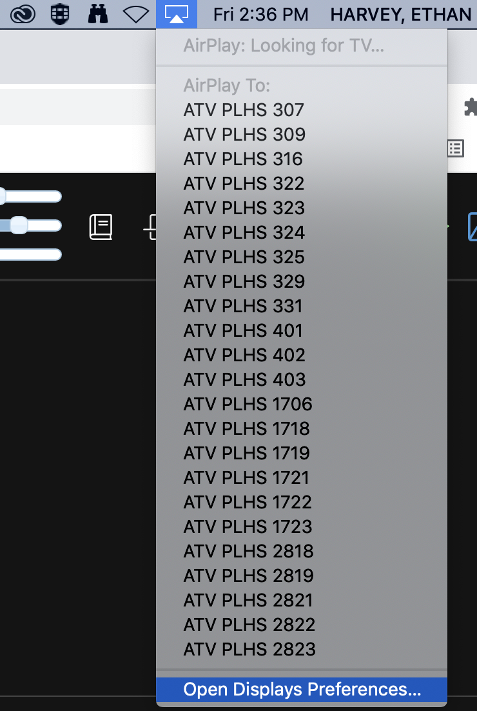
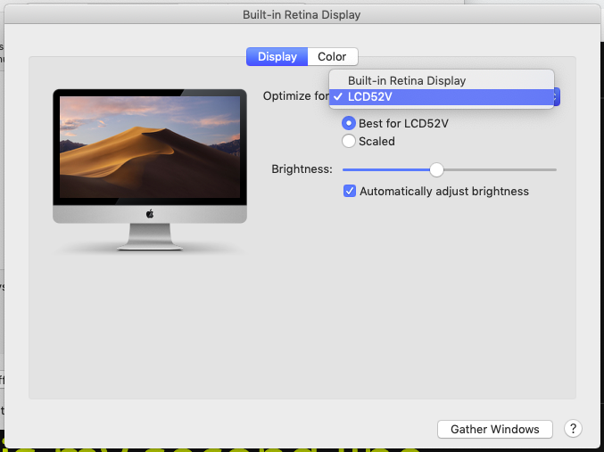

## [Click to View Subsections](headers-h.saa8t5379qfj)

Equipment
=========

\[TODO:\]

Teleprompter
------------

### Setup

You need

*   Prompter

*   Teleprompter Tripod
*   Tripod Dolly
*   Camera
*   Power Cable
*   Display Cable (& Adaptors, where applicable)

#### Connecting the Display

Once you have the display plugged in using the relevant adaptors, it may not immediately work as intended. To change display settings, go to the top-right corner of your screen and select open display preferences under the display dropdown.

From there, go to the arrangement tab and check the “Mirror Displays” checkbox.

.

If your screen stays the same resolution, make sure to click “Optimize for LCD52V.”

Now whatever you do will show up on the prompter!

### Website and Usage

The easiest site for this is [Teleprompter Mirror](https://www.google.com/url?q=https://telepromptermirror.com/telepromptersoftware.htm&sa=D&source=editors&ust=1646877750801625&usg=AOvVaw2ghE8DyFVdkGpF3Xd_Vajc).

If possible, it’s easiest to just directly type the lines in. If you need to copy/paste from a document, you can do so, but if the formatting gets weird make sure to click this button ONCE. 

(I’d recommend pasting in line-by-line, otherwise it doesn’t add the newlines. There are workarounds if you have a massive script, but if you only have a few lines this is easiest.)

When you’re ready to go, make sure to click this button so that it flips the text around the right way in the mirror.

 (If you can’t see this button at first, click the dropdown button).

To adjust speed, use the left and right arrows on your keyboard.

To adjust text size, use the up and down arrows.

To play/pause, use the spacebar.

If you want text to be center-aligned, click this button.

The Toolbox
-----------

\[TODO:\]

Cables
------

\[TODO:\]

### Video Cables

\[TODO:\]

HDMI

SDI Signals - BNC RG-6 & SMA

VGA

DisplayPort

### Audio Cables

Auxiliary

XLR

### Power Cables

C13 Cord (Monitor Power)

\[Something... something... camera power TODO:\]

### Data Cables

\[TODO:\]

#### USB Types

The primary USB connector types are below. There is also a designation between versions, such as USB 3.0 connectors being colored blue on the inside, but for the most part this

difference does not affect us - if it does, just look for the blue USB 3.0.

### Network Cables

CAT5 & CAT6 (Ethernet)

Thunderbolt 2 Dongle